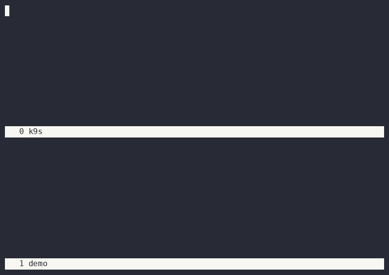

# litmus-demo

A minimal LitmusChaos pod-delete experiment against a k3s cluster.

Installs `litmus-core` (the chaos-operator alone — no ChaosCenter portal or
MongoDB), deploys a disposable 3-replica nginx target, kills ~50% of its
pods, waits for Kubernetes to reschedule them, and prints the verdict. Tears
itself down on exit.

## Run

```
./run.sh
```

Requires `kubectl` and `helm` pointed at a working cluster.

## Demo



Two-pane recording: `k9s` watching `litmus-demo` (top) beside the scripted
run (bottom). Recorded with `asciinema` + `agg` inside a `screen` split.
Re-run it yourself with:

```
asciinema rec demo.cast -c "screen -c screenrc" --overwrite
agg demo.cast demo.gif
```

## Layout

- `manifests/00-namespace.yaml` — the `litmus-demo` namespace
- `manifests/01-nginx-target.yaml` — target deployment, 3 replicas
- `manifests/02-pod-delete-fault.yaml` — the `pod-delete` ChaosExperiment CR (from [litmuschaos/chaos-charts](https://github.com/litmuschaos/chaos-charts))
- `manifests/03-rbac.yaml` — ServiceAccount/Role/RoleBinding scoped to the fault's declared permissions
- `manifests/04-chaosengine.yaml` — the ChaosEngine that runs the fault against the target
- `run-demo.sh` / `screenrc` — narrated wrapper + `screen` layout used for the recording (not meant to run standalone)
- `demo.cast` / `demo.gif` — the recording itself (`asciinema play demo.cast` to replay in a terminal)

## Notes

- On teardown, `run.sh` clears the ChaosEngine's finalizer before deleting
  the namespace — the finalizer expects the chaos-operator to remove it, and
  the operator is already gone by then (`helm uninstall` runs first), which
  otherwise stalls namespace deletion indefinitely.
